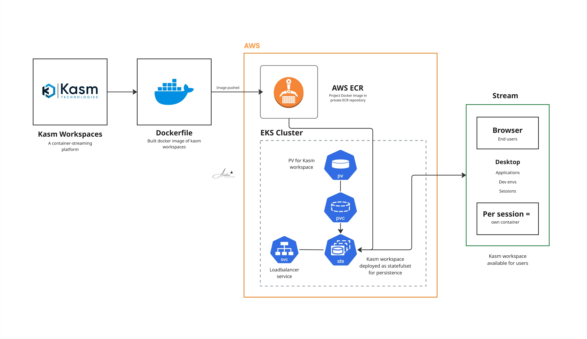

# Kasm Workspaces Deployment on AWS EKS


## Overview

Dockerized and deployed Kasm Workspaces on an AWS EKS cluster with persistent storage. Kasm is a container streaming platform that delivers browser-based access to desktops, applications, and development environments — every user session runs in its own isolated container. The deployment includes a hostPath PersistentVolume, PVC binding, Kasm deployed as a StatefulSet for data persistence, and full workspace configuration.

## Architecture



The deployment consists of:
- **Kasm Workspaces** containerized with client-specific configuration and pushed to Amazon ECR
- **AWS EKS** cluster provisioned to host the platform
- **PersistentVolume** (hostPath, 10GB, ReadWriteMany) for Kasm data persistence
- **PersistentVolumeClaim** bound to the PV and mounted into the StatefulSet
- **Kasm deployed as a StatefulSet** for stable pod identity and persistent storage binding
- **LoadBalancer Service** exposing Kasm to end users via browser streaming

## Tech Stack

| Layer | Technology |
|-------|-----------|
| Container orchestration | AWS EKS (Kubernetes) |
| Containerisation | Docker |
| Image registry | Amazon ECR |
| Application | Kasm Workspaces |
| Workload type | StatefulSet |
| Storage | PV (hostPath 10GB, ReadWriteMany) + PVC |
| Networking | LoadBalancer Service |
| Access | Browser-based container streaming |

## What Was Built

**1. Dockerized Kasm Workspaces**
- Containerized Kasm with the client's workspace configuration
- Built the Docker image and pushed to a private Amazon ECR repository

**2. AWS EKS cluster**
- Provisioned EKS cluster with node groups sized for Kasm's per-session container workload

**3. PersistentVolume and PersistentVolumeClaim**
- Created a 10GB hostPath PV pointing to /opt on the node
- ReadWriteMany access mode — multiple Kasm pods can read/write simultaneously
- PVC bound to the PV by name and mounted into the StatefulSet

**4. Kasm deployed as StatefulSet**
- Deployed Kasm as a StatefulSet — unlike a Deployment, StatefulSet gives each pod a stable network identity and ensures the PVC binding is maintained across restarts
- LoadBalancer Service exposes Kasm for external browser access

**5. Workspace configuration**
- Configured all Kasm settings — workspaces, users, session policies, and workspace images

**6. Demo delivered**
- Demonstrated browser-based desktop and application streaming live on the cluster

## Project Structure

```
09-kasmWorkspace-DEVOPS/
├── kasm-pv.yaml               (PersistentVolume — 10GB hostPath)
├── kasm-pvc.yaml              (PersistentVolumeClaim)
├── kasm-statefulset.yaml      (StatefulSet + LoadBalancer Service)
└── README.md
```

## Key Learnings

- StatefulSet is the right workload type for Kasm — stable pod identity ensures the PVC stays bound to the same pod across restarts, unlike a standard Deployment
- ReadWriteMany is required because multiple Kasm session containers run simultaneously and all need shared volume access — ReadWriteOnce would block concurrent sessions
- hostPath volumes are node-bound — suitable for single-node or demo environments, but production should use EFS (multi-node) or EBS (single-node with better performance)
- Every Kasm user session is its own isolated container — resource limits and session policies are critical configuration, not just the deployment